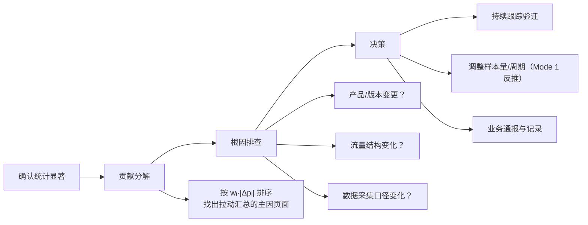

# LDBOM 加权 MDE 业务解读 SOP

> **适用场景**：长期观测 · 比例指标 · 样本量计算器 Mode 2（样本量 → 精度）· LDBOM 分页面加权  
> **版本**：v1.0.0（2026-07-16）  
> **关联文档**：
> - [MDE 通俗讲解](../tools/sample-size/mde-business-guide.html) — MDE 基础概念
> - [分页面精度方法论](../tools/sample-size/page-precision-methodology.md) — 公式推导
> - [反直觉算例](../tools/sample-size/weighted-mde-counterintuitive-example.md) — 汇总 MDE 与汇总比例的差异
> - [显著性检验工具](../tools/significance-test/index.html) — 比例 z 检验

---

## 1. 这份 SOP 解决什么问题

业务在使用样本量计算器做 **LDBOM 分页面加权 MDE** 后，拿实际观测波动去对比，常遇到两类困惑：

| 困惑 | 典型表现 |
|------|----------|
| **困惑 1** | 各页面下跌幅度都没超出各自 MDE，但**汇总指标却略超出**汇总 MDE |
| **困惑 2** | 波动**超出 MDE 范围**时，不知道该报警、该排查，还是当作正常噪声 |

本 SOP 给出：**标准操作流程、决策分支、解读原则与常用 QA**。

---

## 2. 核心概念（30 秒版）

| 概念 | 一句话 |
|------|--------|
| **MDE** | 在当前样本量下，能「稳定看清」的最小变化幅度（含功效项，比纯置信区间更保守） |
| **单页 MDE** | 仅看该页自身样本，能检出的最小波动：\( \mathrm{MDE}_i = Z\sqrt{p_i(1-p_i)/n_i} \) |
| **汇总 MDE** | 加权合成指标能检出的最小波动：\( \mathrm{MDE}_{\text{整体}} = Z\sqrt{\sum w_i^2 p_i(1-p_i)/n_i} \) |
| **实际波动** | 观测比例与基准（上期 / 计划值）之差：\( \Delta p_i = \hat{p}_i - p_{i,\text{基准}} \) |
| **汇总波动** | 加权合成后的变化：\( \Delta P = \sum w_i \Delta p_i \)（**不是**各页波动的最大值） |

**关键认知**：单页 MDE 与汇总 MDE 衡量的是**不同层级的精度门槛**，二者**不能互相替代**，也**不能简单相加**。

---

## 3. 业务流程总览

```mermaid
flowchart TD
    A([开始：长期观测 LDBOM 加权指标]) --> B[① 规划期：样本量计算器 Mode 2]
    B --> B1[填写各页权重 wᵢ、预期比例 pᵢ、实际样本量 nᵢ]
    B1 --> B2[记录输出：单页 MDEᵢ + 汇总 MDE_整体]
    B2 --> B3[记录基准值 pᵢ_基准（上期或计划值）]
    B3 --> C[② 观测期：采集实际数据]

    C --> C1[各页：成功数 xᵢ、样本量 nᵢ]
    C1 --> C2[计算观测比例 p̂ᵢ = xᵢ/nᵢ]
    C2 --> C3[计算单页波动 Δpᵢ = p̂ᵢ − pᵢ_基准]
    C3 --> C4[计算汇总波动 ΔP = Σ wᵢ·Δpᵢ]

    C4 --> D{③ 对比：|波动| vs MDE}
    D --> D1[单页：|Δpᵢ| vs MDEᵢ]
    D --> D2[汇总：|ΔP| vs MDE_整体]

    D1 --> E{汇总或任一页<br/>接近/超出 MDE？}
    D2 --> E

    E -->|全部明显在 MDE 内<br/>（如 &lt; 80% MDE）| F[✅ 继续监测<br/>无需行动]
    E -->|接近 MDE（80%–100%）<br/>或已超出| G[④ 执行比例 z 检验]

    G --> G1{检验对象}
    G1 --> G1a[单页：各异常页 vs 基准 p₀]
    G1 --> G1b[汇总：加权合成指标 vs 基准 P₀]
    G1a --> H[使用显著性检验工具<br/>单样本 z 比例检验]
    G1b --> H

    H --> I{p 值是否显著？<br/>（建议 α=0.05 或业务约定值）}
    I -->|p ≥ α，不显著| J[⚪ 视为抽样噪声<br/>继续监测，不升级]
    I -->|p &lt; α，显著| K[🔴 确认有统计意义上的变化]

    K --> L{⑤ 业务 Action}
    L --> L1[定位贡献最大的页面<br/>（按 wᵢ·|Δpᵢ| 排序）]
    L --> L2[排查近期产品/运营/流量变化]
    L --> L3[评估是否需要调整样本量或观测周期]
    L --> L4[向相关方通报，记录结论]

    F --> M([下一观测周期])
    J --> M
    L4 --> M
```

---

## 4. 分步操作 SOP

### 步骤 ① 规划期：计算 MDE（样本量 → 精度）

**工具**：[样本量计算器 · 长期观测 · Mode 2](../tools/sample-size/index.html)

| 操作 | 说明 |
|------|------|
| 选择场景 | 长期观测 |
| 选择模式 | Mode 2：样本量 → 精度 |
| 填写 LDBOM | 勾选参与合成的页面，填写权重 \(w_i\)、预期比例 \(p_i\)、样本量 \(n_i\) |
| 记录输出 | **单页 MDE**（各行）+ **汇总 MDE**（合计行） |
| 固定基准 | 记录各页基准比例 \(p_{i,\text{基准}}\) 及汇总基准 \(P_0 = \sum w_i p_{i,\text{基准}}\) |
| 存档 | 建议截图或导出，标注计算日期、α、Power |

> **注意**：工具默认 α=0.2、Power=0.7（偏宽松，适合持续监测）。若业务报警阈值更严，请在 z 检验步骤使用 α=0.05。

---

### 步骤 ② 观测期：计算实际波动

每个观测周期结束时：

```
单页观测比例：  p̂ᵢ = xᵢ / nᵢ
单页波动：      Δpᵢ = p̂ᵢ − pᵢ_基准
汇总波动：      ΔP  = Σ wᵢ · Δpᵢ
               （等价于 P̂_整体 − P₀，其中 P̂_整体 = Σ wᵢ · p̂ᵢ）
```

**对比方式**：

| 层级 | 对比公式 | 判定 |
|------|----------|------|
| 单页 | \(|\Delta p_i|\) vs \(\mathrm{MDE}_i\) | 超出 → 该页「视觉上」值得注意 |
| 汇总 | \(|\Delta P|\) vs \(\mathrm{MDE}_{\text{整体}}\) | 超出 → 合成指标「视觉上」值得注意 |

**「接近 MDE」的经验阈值**：当 \(|\text{波动}| \ge 0.8 \times \mathrm{MDE}\) 时，建议进入步骤 ④ 做 z 检验，不必等到完全超出。

---

### 步骤 ③ MDE 对比后的初步判断

| 情况 | 初步判断 | 建议 |
|------|----------|------|
| 单页和汇总均在 MDE 内（&lt; 80%） | 正常抽样波动 | 继续监测，无需检验 |
| 单页或汇总在 80%–100% MDE | 边界区域，不确定 | 执行 z 检验 |
| 单页或汇总超出 MDE | 超出测量精度门槛 | **必须**执行 z 检验 |
| 各页未超、汇总略超（困惑 1） | 见 §5 解读 | 对**汇总指标**做 z 检验 |

---

### 步骤 ④ 比例 z 检验（确认是否统计显著）

**工具**：[显著性检验 · 单样本 z 比例检验](../tools/significance-test/index.html)

#### 4.1 单页检验

对每个「接近或超出 MDE」的页面：

| 字段 | 填写 |
|------|------|
| metric | 页面名称（如 D 页） |
| x | 本期成功数 |
| n | 本期样本量 |
| p₀ | 该页基准比例（%） |

#### 4.2 汇总检验

对加权合成指标，将整体视为一个「虚拟单样本」：

| 字段 | 填写 |
|------|------|
| metric | 汇总指标 |
| x | 按加权公式折算的「等效成功数」* |
| n | 等效总样本量（Kish ESS 或业务约定的合成 n）* |
| p₀ | 汇总基准 \(P_0\)（%） |

> \* **汇总 z 检验的简化做法**（业务常用）：  
> 直接用 \(P̂_{\text{整体}} = \sum w_i \hat{p}_i\) 与 \(P_0\) 的差，配合汇总标准误  
> \( \mathrm{SE} = \sqrt{\sum w_i^2 \hat{p}_i(1-\hat{p}_i)/n_i} \)  
> 手算 \( z = (P̂ - P_0) / \mathrm{SE} \)。  
> 若需批量检验多页 + 汇总，可用显著性检验工具逐行录入。

#### 4.3 解读检验结果

| 结果 | 含义 | Action |
|------|------|--------|
| p ≥ α（不显著） | 波动可能是随机噪声 | 继续监测，不升级 |
| p &lt; α（显著） | 有统计证据支持「确实变了」 | 进入步骤 ⑤ 排查 |
| 显著但效应量很小 | 统计显著 ≠ 业务重要 | 结合业务最小有意义变化（practical significance）判断 |

---

### 步骤 ⑤ 显著变化后的业务 Action



---

## 5. 困惑 1 详解：为什么各页没超 MDE，汇总却超出？

这是**正常现象**，不是计算器 bug。核心原因有三条：

### 原因 A：汇总波动是加权求和，不是「取最大页」

```
ΔP = w_D·Δp_D + w_B·Δp_B + … + w_M·Δp_M
```

当多个页面**同向**波动（如都在下跌），即使每页跌幅各自小于该页 MDE，**加权求和后**仍可能超过更紧的汇总 MDE。

**数值示例**（各页未超、汇总略超）：

| 页面 | 权重 w | 基准 p | 观测 p̂ | 波动 Δp | 单页 MDE | 单页判定 |
|------|--------|--------|---------|---------|----------|----------|
| D | 0.73 | 42% | 40.2% | −1.8% | ±1.92% | ✅ 未超 |
| B | 0.27 | 24% | 23.35% | −0.65% | ±0.70% | ✅ 未超 |
| **汇总** | — | **37.1%** | **35.6%** | **−1.49%** | **±1.41%** | ⚠️ **略超** |

验算：\( \Delta P = 0.73 \times (-1.8\%) + 0.27 \times (-0.65\%) = -1.49\% \)，超过汇总 MDE 1.41%，但两页各自均在单页 MDE 以内。

### 原因 B：单页 MDE ≠ 汇总 MDE 的「页面份额」

- **单页 MDE** 回答：「只看这一页的数据，能检出多大的变化？」——门槛通常**更宽**（噪声大）。
- **汇总 MDE** 回答：「看加权合成后的整体指标，能检出多大的变化？」——多页信息汇总后门槛通常**更窄**（精度更高）。

因此：**单页未超 ≠ 汇总一定未超**。汇总 MDE 是更灵敏的「整体听诊器」。

### 原因 C：方差贡献不均，高权重页主导汇总

汇总 MDE 由 \( \sum w_i^2 p_i(1-p_i)/n_i \) 决定。高权重、低样本的页面贡献绝大部分方差（详见[反直觉算例](../tools/sample-size/weighted-mde-counterintuitive-example.md)）。

各页「看起来都没大事」，但高权重页的微小下跌足以拉动汇总越过汇总 MDE。

### 一张图看懂

```
各页波动（各自 vs 各自 MDE）          汇总波动（加权求和 vs 汇总 MDE）
┌─────────────────────────┐          ┌─────────────────────────┐
│ D: −1.8%  |····|  MDE 1.92% │          │                         │
│ B: −0.65% |···|   MDE 0.70% │   →    │ ΔP = −1.49% |····| MDE 1.41% │ ← 略超
│ O: −0.3%  |·|     MDE 1.50% │          │                         │
└─────────────────────────┘          └─────────────────────────┘
  每页各自过关                           同向叠加后汇总可能超标
```

**结论**：出现「分页面未超、汇总略超」时，**优先看汇总 MDE 和汇总 z 检验结果**，不要仅用单页 MDE 否定整体信号。

---

## 6. 困惑 2 详解：超出 MDE 时如何解读？

### 6.1 先分清三层含义

| 层级 | 问题 | 工具/方法 |
|------|------|-----------|
| **精度层** | 波动是否超出了「能看清的刻度」？ | 对比 \|波动\| vs MDE |
| **统计层** | 波动是否统计显著（非随机）？ | z 比例检验 → p 值 |
| **业务层** | 变化是否有业务意义？ | 业务最小有意义变化 + 贡献分解 |

**超出 MDE 只回答了精度层**，还需要 z 检验回答统计层。

### 6.2 超出幅度的解读指南

| 超出程度 | 统计层建议 | 业务层建议 |
|----------|------------|------------|
| 刚超出（100%–120% MDE） | **必须做 z 检验**；p 值可能在 0.05 附近 | 谨慎关注，不宜立即定性为「事故」 |
| 明显超出（120%–200% MDE） | z 检验大概率显著 | 启动贡献分解与根因排查 |
| 大幅超出（&gt; 200% MDE） | 几乎一定显著 | 升级通报，检查数据口径 |

### 6.3 常见误读（务必避免）

| 误读 | 正确理解 |
|------|----------|
| 「超出 MDE = 显著变差」 | 超出 MDE 仅表示「变化幅度接近或超过测量精度」；是否「真的变了」看 p 值 |
| 「没超出 MDE = 没问题」 | 没超出只说明「变化太小，当前样本看不清」；不等于「指标健康」 |
| 「单页都没超，汇总不用管」 | 汇总指标才是业务最终 KPI，汇总超出应单独检验 |
| 「MDE 和 z 检验 α 是一回事」 | MDE 含 Power 项（默认 Power=0.7）；z 检验 α 通常取 0.05，二者严格程度不同 |

### 6.4 推荐话术（对内沟通）

> 「本期汇总满意率下降 0.9%，略超出我们规划的 MDE（±1.41%）。这表示变化幅度已进入'需要仔细分辨'的区间。我已用 z 检验复核：p = 0.03，统计显著。主要拉动来自 D 页（贡献约 73%）。建议产品侧排查 D 页近期变更，下周期继续跟踪验证。」

---

## 7. Action 决策矩阵（速查）

| 单页 vs MDE | 汇总 vs MDE | z 检验 | 建议 Action |
|-------------|-------------|--------|-------------|
| 全部在内 | 在内 | 不需要 | 继续监测 |
| 全部在内 | 接近/超出 | **汇总检验** | 看汇总 p 值；分解贡献页 |
| 部分超出 | 在内 | 异常页检验 | 排查异常页，汇总可暂不升级 |
| 部分超出 | 超出 | 全部检验 | 全面排查 + 贡献分解 |
| 全部在内 | 超出（困惑 1） | **汇总检验** | 正常现象；以汇总为准 |

---

## 8. 常用 QA

### Q1：为什么各页面波动都没超出各自 MDE，汇总却超出了？

**A**：因为汇总波动 \( \Delta P = \sum w_i \Delta p_i \) 是**加权求和**，不是取各页最大值。当多页**同向**变化时，效应叠加；而汇总 MDE 通常**比单页 MDE 更窄**（合成后精度更高）。两者衡量层级不同，不能互相替代。详见 §5。

---

### Q2：波动超出 MDE 了，是否意味着指标真的变差了？

**A**：不一定。超出 MDE 表示「变化幅度已达到或超过当前样本量能稳定分辨的刻度」，属于**精度层**信号。是否「真的变了」需要 z 检验的 p 值来确认（**统计层**）。即使统计显著，还需判断变化幅度是否有**业务意义**（业务层）。

---

### Q3：什么时候该做 z 检验？

**A**：建议以下任一条件满足时执行：

1. 汇总或任一页 \( |\text{波动}| \ge 0.8 \times \mathrm{MDE} \)（接近边界）
2. 汇总或任一页 \( |\text{波动}| > \mathrm{MDE} \)（已超出）
3. 出现「分页面未超、汇总超出」的情况（对汇总做检验）
4. 业务方主观认为趋势异常，需要统计证据支撑

工具：[显著性检验](../tools/significance-test/index.html)

---

### Q4：MDE 对比和 z 检验有什么区别？会不会重复？

**A**：不重复，回答不同问题。

| | MDE 对比 | z 检验 |
|---|----------|--------|
| **时机** | 每个观测周期例行对比 | 接近/超出 MDE 时触发 |
| **回答** | 「变化是否大到值得注意？」 | 「变化是否统计显著（非随机）？」 |
| **严格度** | 含 Power 项（默认 0.7） | 仅含 α（通常 0.05） |
| **成本** | 低（心算或表格） | 低（工具一键计算） |

MDE 是**日常筛查**，z 检验是**确认诊断**。

---

### Q5：汇总 z 检验怎么填数据？

**A**：两种做法：

**做法一（推荐，精确）**：手算汇总 z 值

\[
z = \frac{\hat{P}_{\text{整体}} - P_0}{\mathrm{SE}}, \quad \mathrm{SE} = \sqrt{\sum_i w_i^2 \frac{\hat{p}_i(1-\hat{p}_i)}{n_i}}
\]

**做法二（简化）**：在显著性检验工具中，将汇总指标作为一行，p₀ 填汇总基准，x 和 n 按加权等效折算。若不确定等效 n，优先用手法一。

---

### Q6：单页 MDE 和汇总 MDE 哪个更重要？

**A**：**汇总 MDE 是业务最终 KPI 的精度门槛**，优先级更高。单页 MDE 用于定位「哪一页的噪声最大、哪一页值得单独关注」。日常监测以汇总为主、单页为辅。

---

### Q7：所有页面都在下跌，但都没超出 MDE，需要担心吗？

**A**：

1. 先算汇总波动 \( \Delta P \)，对比汇总 MDE
2. 若汇总也未超 → 大概率是正常噪声，继续监测
3. 若汇总接近或超出 → 做汇总 z 检验
4. 若多期连续同向（如连续 3 期下跌）即使每期未超 MDE → 建议做趋势检验或扩大观测窗口

---

### Q8：MDE 用的是计划比例 pᵢ，但实际比例变了，MDE 还准吗？

**A**：MDE 对 p 的依赖通过 \( p(1-p) \) 体现。当实际比例偏离计划值较远时，应用**本期实际 p̂ᵢ** 回算 Mode 2 得到「当前 MDE」，再与波动对比。偏差不大时（如 ±2pp 以内），原计划 MDE 仍可作为近似参考。

---

### Q9：α=0.2 和 α=0.05 用哪个？

**A**：

| 场景 | 建议 α |
|------|--------|
| 样本量计算器算 MDE（规划期） | 工具默认 0.2（持续监测，减少误报） |
| z 检验（确认期） | 建议 0.05（标准假设检验） |
| 高敏感情报（如合规指标） | 0.01 或 Bonferroni 校正 |

两者服务不同阶段，不矛盾。

---

### Q10：超出 MDE 后，样本量不够怎么办？

**A**：切换至样本量计算器 **Mode 1（精度 → 样本量）**，输入目标 MDE δ，反推各页所需样本量。若短期无法增加流量，则接受更粗的 MDE，并在解读时更谨慎（更多依赖 z 检验而非 MDE 对比）。

---

## 9. 附录：公式速查

```
规划期（Mode 2）：
  单页 MDEᵢ = Z · √(pᵢ(1−pᵢ) / nᵢ)
  汇总 MDE  = Z · √(Σ wᵢ² · pᵢ(1−pᵢ) / nᵢ)
  Z = Φ⁻¹(1−α/2) + Φ⁻¹(Power)

观测期：
  单页波动 Δpᵢ = p̂ᵢ − pᵢ_基准
  汇总波动 ΔP  = Σ wᵢ · Δpᵢ

对比：
  |Δpᵢ| vs MDEᵢ        → 单页筛查
  |ΔP|  vs MDE_整体     → 汇总筛查

确认期（z 检验）：
  单页：z = (p̂ᵢ − p₀) / √(p₀(1−p₀) / nᵢ)
  汇总：z = (P̂ − P₀) / √(Σ wᵢ² · p̂ᵢ(1−p̂ᵢ) / nᵢ)
```

---

## 10. 相关工具链接

| 工具 | 用途 | 链接 |
|------|------|------|
| 样本量计算器 Mode 2 | 计算单页 / 汇总 MDE | [tools/sample-size/index.html](../tools/sample-size/index.html) |
| 样本量计算器 Mode 1 | 反推所需样本量 | 同上 |
| 显著性检验 | 比例 z 检验确认 | [tools/significance-test/index.html](../tools/significance-test/index.html) |
| MDE 通俗讲解 | 基础概念入门 | [tools/sample-size/mde-business-guide.html](../tools/sample-size/mde-business-guide.html) |
| 反直觉算例 | 深入理解汇总 MDE | [tools/sample-size/weighted-mde-counterintuitive-example.md](../tools/sample-size/weighted-mde-counterintuitive-example.md) |
